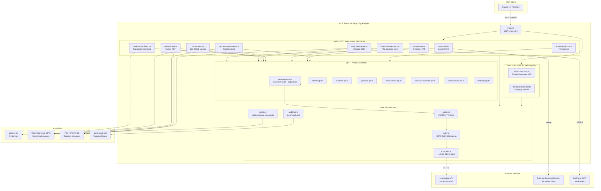

# Architecture Diagram

## Layer Summary

| Layer | Role |
|---|---|
| **Tools** | Domain logic — invoices, bank, tax, OCR, reporting |
| **API clients** | Resource-specific REST wrappers (CRUD + pagination) |
| **Cache** | In-memory LRU, auto-invalidated on mutations |
| **Auth** | Signs every request with HMAC-SHA-384 |
| **HTTP client** | Rate-limited, timeout-guarded outbound calls |
| **Config** | Multi-company credential loading & switching |
| **Audit log** | Append-only markdown log of all mutations |

## Workflow prompt pipeline

The 16 workflow prompts and their `.claude/commands` slash-command twins are
generated by one pipeline, not hand-written per surface. The stages are:

**registry → workflow source → shared renderer → MCP prompts and slash commands**

1. **Canonical registry — `src/prompt-registry.ts`.** The single source of truth
   for every workflow prompt: its `name`, `slug`, description, feature
   predicate, sales-aware variants, and its argument schema.
   Every prompt argument is a string (parsed through `src/prompt-arguments.ts`),
   not numeric or boolean — a client always passes wire strings, and
   the registry parses them into typed values, rejecting a malformed value with
   a safe bounded MCP error.
2. **Workflow source — `workflows/*.md` via `src/workflow-prompt-source.ts`.**
   The prose body of each prompt lives in a Markdown file under `workflows/`,
   loaded by slug. Prompt **text does not live in `src/prompt-registry.ts` or
   `src/prompts.ts`** — those wire the pipeline; the words come from the
   workflow Markdown, with `E_ARVELDAJA_FEATURE_*` markers delimiting the
   **sales-aware variant** sections that are kept or dropped per deployment.
3. **Shared renderer — `src/prompt-surface.ts`.** One renderer resolves feature
   sections, injects the shared safety wrapper, sandboxes any external text
   inside a fresh per-call `E_ARVELDAJA_RUN_DATA` boundary, and enforces the
   64,000-character surface budget. Both output surfaces render through it, so
   an MCP prompt and its slash command are byte-identical.
4. **Output surfaces.** `src/prompts.ts` registers the rendered prompts as **MCP
   prompts**; `npm run sync:workflow-prompts` writes the same rendered text to
   the `.claude/commands/*.md` slash commands.

### Load-bearing safety claims the pipeline states

- **A plan handle is not user approval.** The shared wrapper states that a
  server-issued plan handle binds scope only; explicit human approval is
  recorded separately, and no data text can waive an approval gate before a
  mutation. Mutating workflows (CAMT, reconciliation, Lightyear, Wise,
  credentials) are one-attempt server plans with pre-mutation drift gates.
- **Opaque file references.** File inputs are exchanged as opaque `file_ref`
  handles bound to the runtime safety context, not raw filesystem paths, so a
  hostile filename never re-enters a later tool call as a live path.
- **Staged receipts.** The receipt flow is staged: **create/upload** of PROJECT
  (draft) purchase invoices is one approval, and **confirm**/link to bank
  transactions is a separate later approval — never one pass.
- **Dated VAT/tax metadata.** VAT facts (threshold, rates, effective/verified
  dates) are rendered from the canonical versioned metadata object in
  `src/estonian-tax-rules.ts`, so every prompt and command shows the same dated
  VAT metadata rather than a hardcoded rate.

### Sync and validation

- `npm run sync:workflow-prompts` regenerates the `.claude/commands/*.md`
  mirrors from the workflow sources — edit the `workflows/*.md` source, then
  sync; never edit a mirror by hand.
- `npm run validate:release` checks set-equality across the registry, the
  `workflows/` sources, the `.claude/commands` mirrors, and the README workflow
  table (name set + declared count), so a drift between any surface fails the
  release gate.
