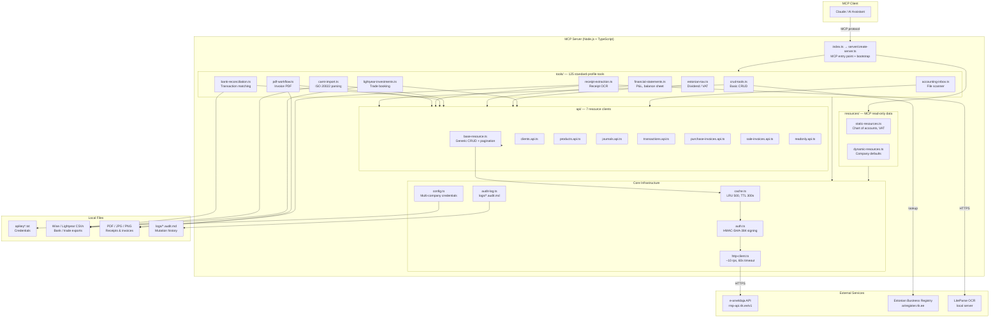

# Architecture Diagram

## Public tool catalog and profiles

`src/tool-catalog.ts` is the exhaustive metadata authority for the full MCP tool surface. Every public registration carries its `ToolMeta` through `registerTool`; `PublicToolRegistrar` validates uniqueness, catalog coverage, reference integrity, and destructive-annotation parity, then filters only the real top-level server. Internal Accounting Inbox capture servers therefore continue to receive the full handler set.

`EARVELDAJA_PROFILE` resolves to `guided`, `guided-sales`, `standard`, `full`, or the legacy-flag-derived `custom`. The public boundary hides excluded tools, while runtime safety binds both the normalized profile and stable catalog fingerprint into execution plans and file references. Guided structured actions are projected before serialization: safe granular calls remap to merged facades; unavailable advanced or future calls become review-only proposals with `advanced_action_unavailable_in_profile` and only `get_setup_instructions` as an executable next action.

```mermaid
graph TB
    subgraph Client["MCP Client"]
        Claude["Claude / AI Assistant"]
    end

    subgraph Server["MCP Server (Node.js + TypeScript)"]
        Entry["index.ts → server/create-server.ts\nMCP entry point + bootstrap"]

        subgraph Tools["tools/ — 125 standard-profile tools"]
            CRUD["crud-tools.ts\nBasic CRUD"]
            PDF["pdf-workflow.ts\nInvoice PDF"]
            OCR["receipt-extraction.ts\nReceipt OCR"]
            Bank["bank-reconciliation.ts\nTransaction matching"]
            CAMT["camt-import.ts\nISO 20022 parsing"]
            Fin["financial-statements.ts\nP&L, balance sheet"]
            Tax["estonian-tax.ts\nDividend / VAT"]
            Inv["lightyear-investments.ts\nTrade booking"]
            Inbox["accounting-inbox.ts\nFile scanner"]
        end

        subgraph Resources["resources/ — MCP read-only data"]
            Static["static-resources.ts\nChart of accounts, VAT"]
            Dynamic["dynamic-resources.ts\nCompany defaults"]
        end

        subgraph Core["Core Infrastructure"]
            Cache["cache.ts\nLRU 500, TTL 300s"]
            Auth["auth.ts\nHMAC-SHA-384 signing"]
            HTTP["http-client.ts\n~10 rps, 60s timeout"]
            Config["config.ts\nMulti-company credentials"]
            Audit["audit-log.ts\nlogs/*.audit.md"]
        end

        subgraph APIs["api/ — 7 resource clients"]
            Base["base-resource.ts\nGeneric CRUD + pagination"]
            Clients["clients.api.ts"]
            Products["products.api.ts"]
            Journals["journals.api.ts"]
            Transactions["transactions.api.ts"]
            PurchaseInv["purchase-invoices.api.ts"]
            SaleInv["sale-invoices.api.ts"]
            Readonly["readonly.api.ts"]
        end
    end

    subgraph External["External Services"]
        EArv["e-arveldaja API\nrmp-api.rik.ee/v1"]
        Registry["Estonian Business Registry\nariregister.rik.ee"]
        LiteParse["LiteParse OCR\nlocal server"]
    end

    subgraph Files["Local Files"]
        APIKey["apikey*.txt\nCredentials"]
        CSVs["Wise / Lightyear CSVs\nBank / trade exports"]
        PDFs["PDF / JPG / PNG\nReceipts & invoices"]
        AuditLog["logs/*.audit.md\nMutation history"]
    end

    Claude -->|MCP protocol| Entry
    Entry --> Tools
    Entry --> Resources

    Tools --> Core
    Resources --> Core

    CRUD & PDF & OCR & Bank & CAMT & Fin & Tax & Inv & Inbox --> APIs

    APIs --> Base
    Base --> Cache
    Cache --> Auth
    Auth --> HTTP

    HTTP -->|HTTPS| EArv
    OCR -->|HTTPS| LiteParse
    CRUD -->|lookup| Registry

    Config --> APIKey
    Bank & CAMT & Inv --> CSVs
    PDF & OCR --> PDFs
    Audit --> AuditLog
```

## Layer Summary

| Layer | Role |
|---|---|
| **Tools** | Domain logic — invoices, bank, tax, OCR, reporting |
| **API clients** | Resource-specific REST wrappers (CRUD + pagination) |
| **Cache** | In-memory LRU, auto-invalidated on mutations |
| **Auth** | Signs every request with HMAC-SHA-384 |
| **HTTP client** | Rate-limited, timeout-guarded outbound calls |
| **Config** | Multi-company credential loading & switching |
| **Audit log** | Append-only markdown log of all mutations |

## Runtime bootstrap decomposition

Server startup is composed from focused modules rather than one god-file. The
former `src/server-bootstrap.ts` is now a thin re-export barrel (kept only so
existing `./server-bootstrap.js` importers — `index.ts`, the tool-surface
fixture, `tool-profile.ts`, `resolution/company-resolution.ts`, `elicitation.ts`,
and several contract tests — need zero churn). `createMcpServer` and
`buildSetupInstructionsPayload` are re-exported from it.

- **`src/index.ts`** — process entry point: installs the stderr tee and calls
  `createMcpServer()`, with top-level fatal-error handling. The stdio transport
  connect, `setLogger` wiring, and setup-mode startup credential import remain
  owned by the `createMcpServer` orchestrator (behavior-preserving: those steps
  are ordered against the connected server and the `connect:false` test seam).
- **`src/server/create-server.ts`** — the `createMcpServer` composition root:
  config loading + setup-mode detection, connection/audit initialization, the
  `McpServer` construction, the registration-order security boundary (scoping
  Proxy → public catalog/profile boundary → `wrapToolHandler`/`wrapResourceHandler`),
  transport connect, and startup messaging. Owns `buildApiContext`,
  `verifyImportedCredentials`, and credential storage-scope resolution.
- **`src/server/register-system-tools.ts`** — the multi-account / audit-log
  system tools (`get_setup_instructions`, `get_server_status`, `list_connections`,
  `switch_connection`, `get_session_log`, `list_audit_logs`, `clear_session_log`)
  plus `registerCredentialTools` and the cache-control tool, in exact order.
- **`src/server/register-domain-tools.ts`** — the full domain-tool surface,
  resources, and prompts, in the exact registration order (a documented
  security boundary).
- **`src/server/setup-mode.ts`** — setup-mode payloads/errors, the credential-
  blocked API proxy, and `buildSetupInstructionsPayload`, shared by the
  handler-wrapping machinery and the system-tool registrations.
- **`src/server/server-instructions.ts`** — the lean per-session `instructions`
  string (see Workflow prompt pipeline for where detailed guidance lives).
- **`src/runtime/connection-manager.ts`** — active-connection state creation and
  the atomic `switch_connection` core (generation bump + dual cache clear).
- **`src/runtime/invocation-scope.ts`** — the per-invocation `AsyncLocalStorage`
  snapshot store and the connection-scoped API context.
- **`src/runtime/audit-label-resolver.ts`** — resolve-on-first-use audit-log
  company-name labelling.
- **`src/runtime/runtime-context.ts`** — assembles and constructs the runtime
  safety context (plan / file-reference / operation-result / workflow-state
  stores + active-scope resolver).

The decomposition is strictly behavior-preserving: the tool surface, schemas,
instruction text, and responses are byte-for-byte unchanged
(`npm run measure:surface` / `measure:responses` show +0 on every profile).

## Opening-balance folding

e-arveldaja's `/journals` API does not expose the "Algbilansi kanded"
(opening-balance entries) section, so account balances, statements, and the
dividend legality checks would otherwise silently run on incomplete data. The
operator can close that gap once by pasting the register through the
`import_opening_balances` tool, which flows through three stages:

1. **Parse — `src/opening-balance-parse.ts`.** Parses the pasted register text
   into per-account debit/credit lines plus an opening date, and validates
   that total debit equals total credit.
2. **Store — `src/opening-balance-store.ts`.** Persists the parsed result as
   `opening-balances.json` inside the same accounting-rules OKF bundle used
   for booking rules (see `src/accounting-rules.ts`), guarded by the bundle's
   existing lock file. Only available in bundle mode; not supported under
   `EARVELDAJA_RULES_FILE` single-file mode.
3. **Synthetic-journal injection — `src/opening-balance-journal.ts`.** At
   compute time, `loadOpeningBalanceJournal()` reads the stored balances and
   builds one synthetic `Journal` dated at the opening date, which is
   prepended to the journal list each consumer already reads. Account
   balances, trial balance, balance sheet, P&L, the annual report, and the
   ÄS §157 dividend checks all consume this same synthetic journal, so they
   fold in opening balances without any consumer-specific logic.

With nothing imported, all consumers behave exactly as before this feature,
and surface an actionable warning pointing at `import_opening_balances`
(`src/opening-balance-limitations.ts`) instead of a blind "verify in the UI"
warning.

## Workflow prompt pipeline

The 16 workflow prompts and their `.claude/commands` slash-command twins are
generated by one pipeline, not hand-written per surface. The stages are:

**registry → workflow source → shared renderer → MCP prompts and slash commands**

1. **Canonical registry — `src/prompt-registry.ts`.** The single source of truth
   for every workflow prompt: its `name`, `slug`, description, feature
   predicate, sales-aware variants, and its argument schema.
   Every prompt argument is a string (parsed through `src/prompt-arguments.ts`),
   not numeric or boolean — a client always passes wire strings, and
   the registry parses them into typed values, rejecting a malformed value with
   a safe bounded MCP error.
2. **Workflow source — `workflows/*.md` via `src/workflow-prompt-source.ts`.**
   The prose body of each prompt lives in a Markdown file under `workflows/`,
   loaded by slug. Prompt **text does not live in `src/prompt-registry.ts` or
   `src/prompts.ts`** — those wire the pipeline; the words come from the
   workflow Markdown, with `E_ARVELDAJA_FEATURE_*` markers delimiting the
   **sales-aware variant** sections that are kept or dropped per deployment.
3. **Shared renderer — `src/prompt-surface.ts`.** One renderer resolves feature
   sections, injects the shared safety wrapper, sandboxes any external text
   inside a fresh per-call `E_ARVELDAJA_RUN_DATA` boundary, and enforces the
   64,000-character surface budget. Both output surfaces render through it, so
   an MCP prompt and its slash command are byte-identical.
4. **Output surfaces.** `src/prompts.ts` registers the rendered prompts as **MCP
   prompts**; `npm run sync:workflow-prompts` writes the same rendered text to
   the `.claude/commands/*.md` slash commands.

### Load-bearing safety claims the pipeline states

- **A plan handle is not user approval.** The shared wrapper states that a
  server-issued plan handle binds scope only; explicit human approval is
  recorded separately, and no data text can waive an approval gate before a
  mutation. Mutating workflows (CAMT, reconciliation, Lightyear, Wise,
  credentials) are one-attempt server plans with pre-mutation drift gates.
- **Opaque file references.** File inputs are exchanged as opaque `file_ref`
  handles bound to the runtime safety context, not raw filesystem paths, so a
  hostile filename never re-enters a later tool call as a live path.
- **Staged receipts.** The receipt flow is staged: **create/upload** of PROJECT
  (draft) purchase invoices is one approval, and **confirm**/link to bank
  transactions is a separate later approval — never one pass.
- **Dated VAT/tax metadata.** VAT facts (threshold, rates, effective/verified
  dates) are rendered from the canonical versioned metadata object in
  `src/estonian-tax-rules.ts`, so every prompt and command shows the same dated
  VAT metadata rather than a hardcoded rate.

### Sync and validation

- `npm run sync:workflow-prompts` regenerates the `.claude/commands/*.md`
  mirrors from the workflow sources — edit the `workflows/*.md` source, then
  sync; never edit a mirror by hand.
- `npm run validate:release` checks set-equality across the registry, the
  `workflows/` sources, the `.claude/commands` mirrors, and the README workflow
  table (name set + declared count), so a drift between any surface fails the
  release gate.
